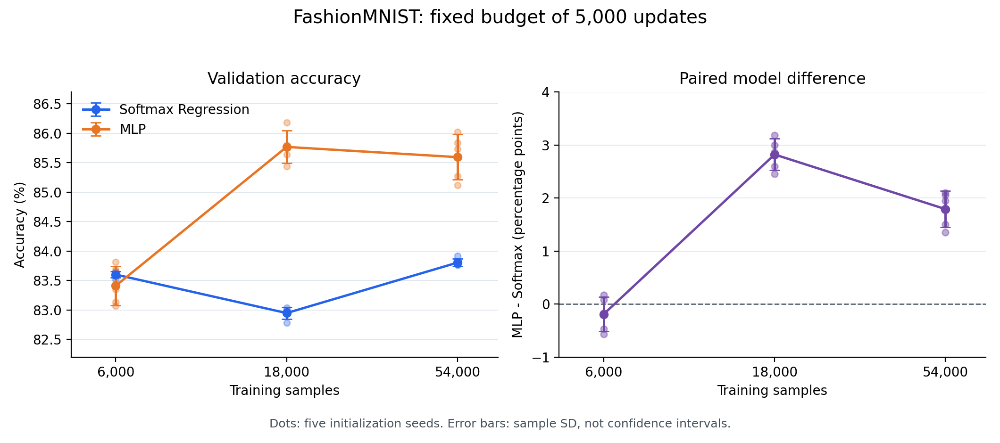

# 固定更新预算下的训练数据量实验

记录日期：2026-10-02。

本记录对应 README 的第二个研究问题。实验计划在开展试运行前于对话中确定；本文在补跑剩余组合之前归档计划，随后补充完整结果。

## 实验计划

### Research Question（研究问题）

固定参数更新次数时，训练数据量从 6,000 增加到 18,000、54,000，Softmax Regression 与 MLP 的验证表现及差距如何变化？

### Hypothesis（假设）

更多训练数据可能改善验证表现，但有限训练预算下不一定单调提升，也不预设 MLP 在所有数据量和初始化下都更好。

### Independent Variables（比较变量）

- 训练子集大小：6,000、18,000、54,000。
- 模型：Softmax Regression（784 → 10）与 MLP（784 → 128 → ReLU → 10），线性层含偏置。
- 重复实验因素：初始化 seed 42、43、44、45、46。每种数据量均比较两个模型和五个初始化，共 30 组。

### Control Variables（固定配置）

| 项目 | 设置 |
| --- | --- |
| 数据来源 | FashionMNIST 官方训练集，共 60,000 个样本 |
| 训练池与验证集 | 独立生成器、split seed 42；训练池 54,000，验证集 6,000 |
| 子集选择 | 独立生成器、subset seed 42；对训练池位置生成一份随机排列，取前 N 个，构成嵌套子集 |
| 预处理 | ToTensor，无额外数据增强 |
| 训练预算 | 每组恰好 5,000 次 optimizer.step() |
| 训练批次 | batch size 32，drop_last=True，shuffle=True，num_workers=0 |
| 训练顺序 | 独立生成器、shuffle seed 42，正式训练前重置一次；遍历完后继续下一轮打乱 |
| 优化器与损失 | SGD，学习率 0.1，momentum 0，weight decay 0；CrossEntropyLoss |
| 验证 | 最后一次更新后 model.eval()、torch.no_grad()；batch size 32，保留全部样本 |
| 设备 | 本机 CUDA，RTX 5080 Laptop GPU |
| 环境 | Windows，Python 3.13.9；torch 2.11.0+cu128、torchvision 0.26.0+cu128 |
| 确定性设置 | torch.use_deterministic_algorithms(True)，CUBLAS_WORKSPACE_CONFIG=:4096:8 |

每组均处理 160,000 次样本呈现，包含重复样本；不同数据量下的遍历次数不同。不同大小子集无法使用完全相同的实际样本序列，但采用相同的打乱规则和 seed；同一数据量下，两种模型的训练样本顺序一致。

### Metrics（指标）

- 总体验证准确率：正确预测数 / 6,000。
- 各真实类别召回率：该类别正确预测数 / 该类别验证样本数。
- 原始混淆矩阵：行是真实类别，列是预测类别。
- 每种数据量下，汇总五个初始化的均值、样本标准差和 MLP − Softmax 差值。
- 训练日志中的损失是本次遍历处理过的样本的平均损失；最后一次遍历可能不完整，跨数据量的统计窗口不同，不将该损失直接作为统一窗口的比较指标。

准确率和召回率使用原始正确数量计算后汇总。标准差采用 n−1 分母，n=5；百分比指标的标准差和模型差值单位为百分点。“均值 ± 标准差”不表示置信区间。

### Procedure（步骤）

1. 将官方训练集固定划分为训练池与验证集；只在训练池中选择嵌套子集。
2. 在同一数据量下，对两个模型分别使用预先确定的五个初始化，从新进程开始训练。
3. 完成 5,000 次更新后评估完整验证集，将完整终端输出保存至 results/。
4. 文件名包括模型、训练样本数、初始化 seed 和更新预算，避免与此前 3 个 epoch 的日志混用。
5. 核对日志中的配置、实际更新次数、类别样本数、矩阵总数、行总数与对角线，补跑缺少的组合。
6. 收集全部 30 组后再分析数据量趋势和模型差异，不按结果挑选初始化。

## 与此前实验的关系

本实验使用固定 5,000 次更新，并在训练池中加入固定随机排列及 drop_last=True。此前比较和初始化实验使用 3 个 epoch，训练顺序与预算也不同，其结果保留在 comparison.md、initialization.md 中，不直接复用为本实验的 54,000 样本组。

官方测试集未用于本实验。

## 运行结果

已收集并核对全部 **30 组**。复用了用户已经完成的 3 份日志，助手补跑其余 27 组；没有按准确率选择性删除或重新运行某个组合。

### 数据与运行核对

- 训练池与验证集互不重叠，三个训练子集分别包含 6,000、18,000、54,000 个唯一样本，且按计划嵌套。
- 30 组均使用 CUDA，固定 split／shuffle／subset seed 为 42，并恰好完成 5,000 次更新。
- 所有验证集均为 6,000 个样本，各类别数量为 `[658, 611, 612, 562, 607, 613, 600, 537, 598, 602]`。
- 各矩阵总数、行总数、对角线和类别正确数一致。每次遍历的更新边界也与 `floor(train_size / 32)` 一致，最后在 5,000 处停止。
- 补跑时，每组在独立新进程内设置 `train_size`、`init_seed`、`model_name`，沿用同一份训练程序；结束后确认工作区中的训练源文件内容没有被批量运行改变。
- [机器可读结果](results/data_size_summary.json) 保存全部指标、混淆矩阵、配置、批量执行时的源码文本和源码校验值。3 份已有日志未保存当时的源码校验值，补跑的 27 份记录了各自实际执行文本的 SHA-256。
- [数据子集核对](results/data_size_subset_check.json) 保存类别分布、嵌套与不重叠检查、索引序列校验值以及实际软件环境。

### 总体结果

下表的模型列为验证准确率百分比的“均值 ± 样本标准差”；标准差单位为百分点。差值使用同一初始化下的原始正确数量计算，再汇总五个差值。次数列表示 MLP 高于、持平、低于 Softmax 的次数。

| 训练样本数 | Softmax 均值 ± SD | MLP 均值 ± SD | MLP − Softmax 均值 ± SD（百分点） | MLP 高／平／低次数 |
| --- | ---: | ---: | ---: | ---: |
| 6,000 | 83.60 ± 0.05 | 83.41 ± 0.33 | −0.19 ± 0.32 | 2 / 0 / 3 |
| 18,000 | 82.95 ± 0.10 | 85.77 ± 0.28 | +2.82 ± 0.30 | 5 / 0 / 0 |
| 54,000 | 83.80 ± 0.06 | 85.59 ± 0.38 | +1.79 ± 0.34 | 5 / 0 / 0 |



图中的小点表示单个初始化，线和误差条表示五个初始化的均值与样本标准差，不表示置信区间。横轴按数据量的对数尺度排列；线仅连接三个已测数据量。[SVG 矢量图](results/data_size_accuracy.svg) 可用于导出。

### 每个初始化的结果与日志

正确数的分母均为 6,000；点击百分比可查看相应完整日志。表中的模型差值按正确数计算，可能与相减已四舍五入的百分比差 0.01。

| 训练样本数 | 初始化 seed | Softmax 正确数 | MLP 正确数 | Softmax 准确率／日志 | MLP 准确率／日志 | 差值（百分点） |
| --- | ---: | ---: | ---: | ---: | ---: | ---: |
| 6,000 | 42 | 5019 | 5029 | [83.65%](results/softmax_n6000_init42_steps5000.txt) | [83.82%](results/mlp_n6000_init42_steps5000.txt) | +0.17 |
| 6,000 | 43 | 5018 | 4984 | [83.63%](results/softmax_n6000_init43_steps5000.txt) | [83.07%](results/mlp_n6000_init43_steps5000.txt) | −0.57 |
| 6,000 | 44 | 5011 | 5001 | [83.52%](results/softmax_n6000_init44_steps5000.txt) | [83.35%](results/mlp_n6000_init44_steps5000.txt) | −0.17 |
| 6,000 | 45 | 5016 | 5021 | [83.60%](results/softmax_n6000_init45_steps5000.txt) | [83.68%](results/mlp_n6000_init45_steps5000.txt) | +0.08 |
| 6,000 | 46 | 5016 | 4988 | [83.60%](results/softmax_n6000_init46_steps5000.txt) | [83.13%](results/mlp_n6000_init46_steps5000.txt) | −0.47 |
| 18,000 | 42 | 4979 | 5126 | [82.98%](results/softmax_n18000_init42_steps5000.txt) | [85.43%](results/mlp_n18000_init42_steps5000.txt) | +2.45 |
| 18,000 | 43 | 4976 | 5148 | [82.93%](results/softmax_n18000_init43_steps5000.txt) | [85.80%](results/mlp_n18000_init43_steps5000.txt) | +2.87 |
| 18,000 | 44 | 4982 | 5138 | [83.03%](results/softmax_n18000_init44_steps5000.txt) | [85.63%](results/mlp_n18000_init44_steps5000.txt) | +2.60 |
| 18,000 | 45 | 4967 | 5147 | [82.78%](results/softmax_n18000_init45_steps5000.txt) | [85.78%](results/mlp_n18000_init45_steps5000.txt) | +3.00 |
| 18,000 | 46 | 4980 | 5171 | [83.00%](results/softmax_n18000_init46_steps5000.txt) | [86.18%](results/mlp_n18000_init46_steps5000.txt) | +3.18 |
| 54,000 | 42 | 5026 | 5107 | [83.77%](results/softmax_n54000_init42_steps5000.txt) | [85.12%](results/mlp_n54000_init42_steps5000.txt) | +1.35 |
| 54,000 | 43 | 5027 | 5150 | [83.78%](results/softmax_n54000_init43_steps5000.txt) | [85.83%](results/mlp_n54000_init43_steps5000.txt) | +2.05 |
| 54,000 | 44 | 5035 | 5161 | [83.92%](results/softmax_n54000_init44_steps5000.txt) | [86.02%](results/mlp_n54000_init44_steps5000.txt) | +2.10 |
| 54,000 | 45 | 5027 | 5144 | [83.78%](results/softmax_n54000_init45_steps5000.txt) | [85.73%](results/mlp_n54000_init45_steps5000.txt) | +1.95 |
| 54,000 | 46 | 5026 | 5116 | [83.77%](results/softmax_n54000_init46_steps5000.txt) | [85.27%](results/mlp_n54000_init46_steps5000.txt) | +1.50 |

## 子集类别分布

子集通过固定随机排列选择，没有进行按类别分层抽样。随着样本数变化，类别比例和具体图片组成也会变化。下表是数据集中的唯一样本数量，不是 5,000 次更新中累计呈现的数量。

| 类别 | 训练 6,000 | 训练 18,000 | 训练 54,000 | 验证 6,000 |
| --- | ---: | ---: | ---: | ---: |
| T-shirt/top | 585 | 1765 | 5342 | 658 |
| Trouser | 603 | 1765 | 5389 | 611 |
| Pullover | 584 | 1773 | 5388 | 612 |
| Dress | 597 | 1754 | 5438 | 562 |
| Coat | 604 | 1816 | 5393 | 607 |
| Sandal | 555 | 1814 | 5387 | 613 |
| Shirt | 617 | 1798 | 5400 | 600 |
| Sneaker | 642 | 1908 | 5463 | 537 |
| Bag | 594 | 1799 | 5402 | 598 |
| Ankle boot | 619 | 1808 | 5398 | 602 |
| 合计 | 6,000 | 18,000 | 54,000 | 6,000 |

## 逐类别召回率汇总

模型列为召回率百分比的“均值 ± 样本标准差”，差值列单位为百分点；次数按五个初始化逐对比较。各次运行的完整混淆矩阵保存在对应日志和机器可读结果中。

### 6,000 个训练样本

| 类别 | Softmax 均值 ± SD | MLP 均值 ± SD | 差值均值 ± SD（百分点） | MLP 高／平／低次数 |
| --- | ---: | ---: | ---: | ---: |
| T-shirt/top | 81.28 ± 0.07 | 87.26 ± 1.89 | +5.99 ± 1.94 | 5 / 0 / 0 |
| Trouser | 97.22 ± 0.12 | 97.84 ± 0.14 | +0.62 ± 0.07 | 5 / 0 / 0 |
| Pullover | 78.04 ± 0.25 | 82.88 ± 1.88 | +4.84 ± 1.74 | 5 / 0 / 0 |
| Dress | 90.78 ± 0.15 | 91.35 ± 0.95 | +0.57 ± 1.06 | 4 / 0 / 1 |
| Coat | 72.29 ± 0.07 | 71.76 ± 2.95 | −0.53 ± 2.92 | 2 / 0 / 3 |
| Sandal | 86.43 ± 0.14 | 87.31 ± 0.49 | +0.88 ± 0.57 | 5 / 0 / 0 |
| Shirt | 51.37 ± 0.27 | 51.77 ± 1.96 | +0.40 ± 1.97 | 3 / 0 / 2 |
| Sneaker | 91.88 ± 0.17 | 67.26 ± 1.77 | −24.62 ± 1.80 | 0 / 0 / 5 |
| Bag | 94.62 ± 0.07 | 96.05 ± 0.09 | +1.44 ± 0.09 | 5 / 0 / 0 |
| Ankle boot | 93.59 ± 0.09 | 98.84 ± 0.00 | +5.25 ± 0.09 | 5 / 0 / 0 |

### 18,000 个训练样本

| 类别 | Softmax 均值 ± SD | MLP 均值 ± SD | 差值均值 ± SD（百分点） | MLP 高／平／低次数 |
| --- | ---: | ---: | ---: | ---: |
| T-shirt/top | 76.60 ± 0.19 | 76.08 ± 1.87 | −0.52 ± 1.91 | 2 / 0 / 3 |
| Trouser | 96.24 ± 0.12 | 97.32 ± 0.22 | +1.08 ± 0.25 | 5 / 0 / 0 |
| Pullover | 89.58 ± 0.18 | 81.63 ± 1.02 | −7.94 ± 0.88 | 0 / 0 / 5 |
| Dress | 84.77 ± 0.20 | 86.30 ± 1.18 | +1.53 ± 1.17 | 5 / 0 / 0 |
| Coat | 67.91 ± 0.14 | 86.26 ± 1.07 | +18.35 ± 1.10 | 5 / 0 / 0 |
| Sandal | 87.21 ± 0.38 | 85.77 ± 1.00 | −1.44 ± 1.08 | 1 / 0 / 4 |
| Shirt | 47.53 ± 0.52 | 61.70 ± 1.04 | +14.17 ± 1.03 | 5 / 0 / 0 |
| Sneaker | 90.95 ± 0.21 | 93.04 ± 0.54 | +2.09 ± 0.62 | 5 / 0 / 0 |
| Bag | 94.58 ± 0.09 | 95.59 ± 0.45 | +1.00 ± 0.49 | 5 / 0 / 0 |
| Ankle boot | 95.38 ± 0.07 | 95.58 ± 0.57 | +0.20 ± 0.57 | 2 / 2 / 1 |

### 54,000 个训练样本

| 类别 | Softmax 均值 ± SD | MLP 均值 ± SD | 差值均值 ± SD（百分点） | MLP 高／平／低次数 |
| --- | ---: | ---: | ---: | ---: |
| T-shirt/top | 84.77 ± 0.17 | 84.35 ± 1.74 | −0.43 ± 1.66 | 1 / 1 / 3 |
| Trouser | 96.89 ± 0.00 | 96.86 ± 0.39 | −0.03 ± 0.39 | 2 / 1 / 2 |
| Pullover | 88.66 ± 0.27 | 89.58 ± 1.07 | +0.92 ± 0.97 | 4 / 0 / 1 |
| Dress | 89.79 ± 0.16 | 92.78 ± 0.48 | +2.99 ± 0.39 | 5 / 0 / 0 |
| Coat | 69.59 ± 0.72 | 70.87 ± 4.38 | +1.29 ± 4.51 | 3 / 0 / 2 |
| Sandal | 92.89 ± 0.19 | 94.45 ± 0.52 | +1.57 ± 0.38 | 5 / 0 / 0 |
| Shirt | 36.27 ± 0.15 | 44.43 ± 2.24 | +8.17 ± 2.31 | 5 / 0 / 0 |
| Sneaker | 90.28 ± 0.16 | 93.93 ± 0.31 | +3.65 ± 0.43 | 5 / 0 / 0 |
| Bag | 96.02 ± 0.14 | 96.42 ± 0.66 | +0.40 ± 0.66 | 3 / 1 / 1 |
| Ankle boot | 93.49 ± 0.14 | 93.42 ± 0.80 | −0.07 ± 0.84 | 2 / 0 / 3 |

## 结果分析

### Observation（观察）

6,000 样本组中，Softmax 平均准确率为 83.60%，MLP 为 83.41%；MLP 平均低 0.19 个百分点，在五个初始化中为 2 次更高、3 次更低。不能从这个小差距推断 Softmax 在小数据量下始终更好。

18,000 样本组中，Softmax 平均为 82.95%，MLP 为 85.77%，MLP 在五个初始化中均更高，平均差距为 2.82 个百分点。

54,000 样本组中，Softmax 平均为 83.80%，MLP 为 85.59%，MLP 在五个初始化中均更高，平均差距为 1.79 个百分点。

在选定的三个数据量上，两种模型的平均准确率及它们的平均差距都没有单调增加。MLP 从 6,000 到 18,000 的均值提高了 2.36 个百分点，但从 18,000 到 54,000 下降了约 0.17 个百分点；这一小幅下降按原始正确数计算，不代表已经证明 18,000 是最佳数据量。

模型平均差距在 18,000 样本时为 +2.82 个百分点，在 54,000 时为 +1.79 个百分点。当前实验支持的观察是：数据量改变时，模型差距也改变，且在固定更新预算下并非简单随数据量增加而扩大。

### Possible Explanation（可能解释）

固定更新预算意味着每组累计呈现 160,000 次样本，但每个训练样本的平均呈现次数分别约为 26.67、8.89、2.96。更大的训练集提供更多不同图片，同时每张图片平均被重复使用更少；这会与有限优化预算、固定学习率和模型表达能力共同影响结果。

数据量改变也改变了具体训练图片、类别比例和实际 batch 序列。初始化的重复控制不能检验另一份子集抽样是否会产生相同趋势。因此，当前曲线应解释为给定子集与更新预算下的结果。

这些因素可能帮助解释非单调表现，但当前没有完整训练集评估、更多更新预算的对照或优化轨迹分析，尚不能确定原因，也不能据此判断哪组出现了过拟合。

### Limitations（局限）

- 每个数据量只有五个初始化，只有一份验证划分和一条嵌套子集抽样序列；不能直接推广到其他数据划分、子集抽样或更多初始化。
- 固定 5,000 次更新比较的是给定预算下的表现，不能代表各数据量充分训练或各模型分别调参后的最佳表现。
- 各组共享同一验证集，五个初始化不等于五份独立评估数据。样本标准差只反映初始化间波动，未进行统计显著性检验。
- 18,000 与 54,000 样本下 MLP 的平均差异较小，不能只凭均值高低认定中等数据量优于更大数据量。
- 同一初始化编号不代表两个不同结构拥有相同初始权重；模型比较同时涉及参数数量与非线性结构。
- 训练损失按每次遍历统计，跨数据量的窗口不同，最后一次遍历可能不完整；未使用统一步数窗口或固定模型重新评估训练损失。
- 矩阵为类别汇总，没有逐样本预测或模型参数文件，不能据此确定某张图片在两个模型间如何改变预测，或定位具体的视觉原因。
- 3 份已有日志缺少执行时源码校验值；实验源码及结果仍需通过 Git 提交关联。本次未自动提交或上传。
- 官方测试集仍未评估，本记录报告的是验证表现。

## 当前代码与复现

批量执行时使用的完整源码和每组配置保存在机器可读结果中。工作区 [train.py](train.py) 当前仍为 Softmax、18,000 个训练样本、初始化 seed 46；split／shuffle／subset seed 都是 42，max_steps 为 5,000。

复现某组时，在训练程序中设置对应的 `model_name`、`train_size` 和 `init_seed`，保持其余配置不变，再启动一次新程序并保存输出。例如，上述当前配置的命令为：

```powershell
.\.venv\Scripts\python.exe train.py | Tee-Object -FilePath results\softmax_n18000_init46_steps5000.txt
```

###### 该示例会写入对应日志文件，重新核对时应使用新的文件名保留原始记录。
