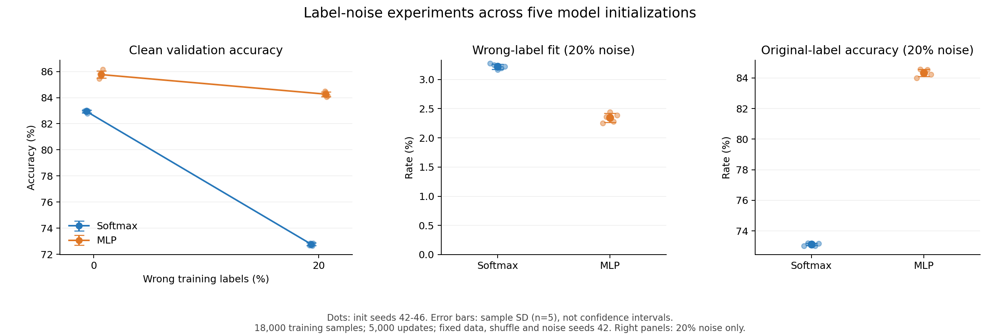

# 错误训练标签与记忆现象：初步实验计划与结果

计划日期：2026-10-02。

本记录对应 README 的第三个研究问题。实验计划在训练前整理；用户先运行 init seed 42 的四组初步实验，随后助手按预先记录的扩展计划补跑 init seed 43～46 的 16 组。现已核对全部 20 份日志。前文保留 seed 42 的初步结果与分析，文末记录五个初始化的汇总结果。

## Research Question（研究问题）

在固定训练数据与更新预算下，把 20% 的训练标签随机改错后，Softmax Regression 和 MLP 对错误标签的拟合行为有何差异？这些行为与它们在干净验证集上的分类表现有何关系？

## Hypothesis（实验前的初步假设）

加入错误标签可能降低干净验证集上的准确率；MLP 可能比 Softmax Regression 更容易拟合被改错的标签，但这不一定带来更好的验证表现。

这是助手在本轮实验前提出的初步假设。本节保留原始预期，不按实际结果改写；下面的观察用于对照这份预期。

## Independent Variables（比较变量）

- 错误标签比例：0% 和 20%。
- 模型：Softmax Regression 与 MLP。

共四组。先在每个模型内部比较 0% 与 20%，再比较两个模型受到的影响。

## Control Variables（固定配置）

| 项目 | 设置 |
| --- | --- |
| 数据来源 | FashionMNIST 官方训练集，共 60,000 个样本 |
| 训练池与验证集 | split seed 42；训练池 54,000 个样本，验证集 6,000 个样本 |
| 训练子集 | 沿用数据量实验的子集选择规则；subset seed 42，取随机排列的前 18,000 个训练池样本 |
| 预处理 | ToTensor，无额外数据增强 |
| 模型结构 | Softmax：Flatten → Linear(784, 10)；MLP：Flatten → Linear(784, 128) → ReLU → Linear(128, 10)；线性层均含偏置 |
| 初始化 | init seed 42；每组重新创建模型和优化器，同一模型的两种噪声条件使用相同初始权重 |
| 训练顺序 | 独立生成器，shuffle seed 42；每组正式训练前重置，四组使用相同的训练样本顺序 |
| 标签噪声 | 独立生成器，noise seed 42；噪声生成不消耗模型初始化或训练打乱使用的随机状态 |
| 训练批次 | batch size 32，shuffle=True，drop_last=True，num_workers=0 |
| 优化器与损失 | SGD，学习率 0.1，momentum 0，weight decay 0；CrossEntropyLoss |
| 训练预算 | 每组恰好 5,000 次参数更新，共 160,000 次样本呈现，包含重复样本 |
| 评估时机 | 最后一次更新后，model.eval() 和 torch.no_grad() |
| 评估批次 | batch size 32，shuffle=False，drop_last=False；评估时保留全部样本 |
| 设备与环境 | 本机 CUDA；Windows、RTX 5080 Laptop GPU、Python 3.13.9、torch 2.11.0+cu128、torchvision 0.26.0+cu128 |
| 确定性设置 | 沿用 torch.use_deterministic_algorithms(True) 和 CUBLAS_WORKSPACE_CONFIG=:4096:8 |

## 标签修改规则

1. 保存训练子集中每个样本的原始标签，以及对应的官方训练集索引。
2. 使用 noise seed 42，从 18,000 个训练样本中无放回选出恰好 3,600 个样本。
3. 对每个选中样本，从其原始标签以外的九个类别中等概率选择一个标签。因此选中样本的标签必定改变，实际错误标签比例恰好为 20%。
4. 修改只发生一次，训练过程中使用固定的错误标签；每次访问样本或开始新一轮遍历时均不重新生成噪声。
5. 两种模型共享同一组选中样本和同一份错误标签，其余 14,400 个样本保持原始标签。
6. 0% 组的全部训练标签保持正确。验证集也始终使用原始正确标签。

当前训练集与验证集通过 Subset 共享底层 full_dataset。实现时应保存训练专用的标签副本，不能直接覆盖共享的 full_dataset.targets，以免污染验证标签或丢失原始标签。

## Metrics（评价指标）

| 指标 | 计算方式 | 含义 |
| --- | --- | --- |
| 干净验证集准确率 | 验证集中预测符合原始标签的数量 / 6,000 | 对未参与训练的干净样本的分类表现 |
| 错误标签拟合率 | 被改标签的训练样本中，预测符合错误标签的数量 / 3,600 | 模型是否学会了人为提供的错误答案 |
| 原始标签准确率（被改标签子集） | 同一批被改标签样本中，预测符合原始标签的数量 / 3,600 | 模型对这些训练样本真实类别的判断能力 |

记录每项指标的正确数量、总数量和比例。两种噪声条件的验证准确率差值按“20% − 0%”计算，单位为百分点。

0% 组没有被改标签的样本，后两项指标记为“不适用”，不能记作 0%，也不能进行除以零的计算。

20% 组的后两项指标使用同一批样本。由于错误标签与原始标签不同，一个预测不能同时匹配两者；它也可能匹配其他类别，所以两项比例之和不一定等于 100%。

## Procedure（实验步骤）

1. 实现训练标签副本和固定噪声生成，先检查标签与数据索引的对应关系。
2. 核对：训练子集 18,000 个样本、被改标签样本恰好 3,600 个、未选中标签不变、选中标签均改变且位于 0–9。
3. 核对：验证标签不变，两种模型的噪声样本与错误标签一致，重复生成可得到相同结果。
4. 加入对被改标签子集的两项评估。该评估使用独立的、不打乱的数据加载流程。
5. 从新进程分别运行 Softmax 0%、Softmax 20%、MLP 0%、MLP 20%；每组训练前重置配置、随机状态、模型与优化器。
6. 本轮重新运行 0% 对照组，统一使用本轮代码。此前数据量实验的结果作为核对参考，保留原始记录。
7. 将每组完整输出保存到 results/，日志包含模型、全部 seed、噪声比例与实际数量、训练样本数、实际更新次数和评估指标。
8. 建议日志名为 results/{model}_n18000_init42_noise{0或20}_steps5000_r01.txt；重复运行使用新编号，保留既有日志。
9. 收齐四组结果并核对计数后，分别填写观察、可能解释与局限。

## 解释范围与局限

- 这是单个初始化、单个训练子集、单份标签噪声下的初步实验，不能据此判断平均趋势或统计显著性。
- 错误标签拟合率是本实验对拟合行为的操作性指标。单个训练终点的指标不能证明模型内部采用了某种记忆机制，也不能说明训练过程中何时开始拟合错误标签。
- 固定 5,000 次更新可能不足以让模型充分拟合错误标签；低拟合率不能证明模型永远无法拟合。
- 本轮采用随机改成其他类别的噪声规则，结论不自动适用于其他错误标签机制或其他噪声比例。
- 官方测试集尚未使用。本轮只评估固定的干净验证集。
- 确定性设置用于核对同一环境内的重复运行，不承诺不同设备或软件版本得到完全相同的数值。

## 运行结果

四组均完成 5,000 次参数更新，使用 init seed 42、18,000 个训练样本与同一份 6,000 样本的干净验证集。20% 噪声组均实际修改 3,600 个训练标签，并评估全部 3,600 个被改标签样本。

| 模型 | 错误标签比例 | 验证正确数 / 样本数 | 验证准确率 | 错误标签匹配数 / 被改样本数 | 错误标签拟合率 | 原始标签匹配数 / 被改样本数 | 原始标签准确率（被改标签子集） |
| --- | --- | --- | --- | --- | --- | --- | --- |
| Softmax Regression | 0% | 4,979 / 6,000 | 82.98% | 不适用 | 不适用 | 不适用 | 不适用 |
| Softmax Regression | 20% | 4,361 / 6,000 | 72.68% | 118 / 3,600 | 3.28% | 2,629 / 3,600 | 73.03% |
| MLP | 0% | 5,126 / 6,000 | 85.43% | 不适用 | 不适用 | 不适用 | 不适用 |
| MLP | 20% | 5,053 / 6,000 | 84.22% | 81 / 3,600 | 2.25% | 3,024 / 3,600 | 84.00% |

原始日志：

- [Softmax，0% 错误标签](results/softmax_n18000_init42_noise0_steps5000_r01.txt)
- [Softmax，20% 错误标签](results/softmax_n18000_init42_noise20_steps5000_r01.txt)
- [MLP，0% 错误标签](results/mlp_n18000_init42_noise0_steps5000_r01.txt)
- [MLP，20% 错误标签](results/mlp_n18000_init42_noise20_steps5000_r01.txt)

日志核对：四组均记录 CUDA、全部 seed、模型、训练样本数、噪声配置与实际完成的更新次数；验证标签保持不变。四份混淆矩阵总数均为 6,000，各行总数与逐类别样本数一致，对角线与正确数量一致。噪声评估计数和输出比例一致，0% 组的两项噪声指标为不适用。

以下差值均由原始正确数量计算后四舍五入，单位为百分点；不直接相减已四舍五入的百分比。

| 模型 | 验证正确数量变化（20% − 0%） | 验证准确率变化（20% − 0%） |
| --- | --- | --- |
| Softmax Regression | −618 | −10.30 个百分点 |
| MLP | −73 | −1.22 个百分点 |

## 实验后的观察与分析（seed 42 初步实验）

### Observation（实际观察）

1. **两种模型的验证准确率均下降。** Softmax 从 82.98% 降至 72.68%，MLP 从 85.43% 降至 84.22%。按原始数量计算，下降分别为 10.30 与 1.22 个百分点；在本轮固定配置下，MLP 的下降幅度较小。
2. **MLP 的错误标签拟合率低于 Softmax。** 在同一批 3,600 个被改标签样本上，Softmax 有 118 个预测符合错误标签，MLP 有 81 个；对应比例为 3.28% 与 2.25%，MLP 低 1.03 个百分点。这一观察未支持实验前“MLP 可能更容易拟合错误标签”的预期。
3. **MLP 在被改标签样本上的原始标签准确率更高。** Softmax 正确判断原始类别的样本数为 2,629，MLP 为 3,024；对应比例为 73.03% 与 84.00%，MLP 高 10.97 个百分点。这两项数值来自参与训练的被改标签子集，与独立验证集准确率分别报告。
4. **两项噪声指标之和没有达到 100%。** Softmax 还有 853 个预测既不符合错误标签，也不符合原始标签；MLP 对应数量为 495。它们预测成了其他类别，不能把所有未匹配错误标签的预测都视为匹配原始标签。

以上仅描述 init seed 42、noise seed 42、18,000 个训练样本和 5,000 次更新下的本轮结果，不作为跨初始化或其他训练预算的普遍结论。

### Possible Explanation（可能解释）

**候选解释：MLP 在当前训练预算下可能更好地利用了正确标签提供的分类规律。** 20% 标签改错后，仍有 14,400 个训练样本的标签正确。MLP 在被改标签样本上的原始标签准确率为 84.00%，在干净验证集上的准确率为 84.22%；这些观察与上述解释相符。但本实验没有直接测量模型学到的特征或内部机制，不能把这个候选解释当作已验证的原因。

**错误标签拟合率也受普通分类错误与预测分布影响。** 即使模型没有根据某个错误标签进行训练，一次普通的分类错误也可能碰巧匹配该错误标签。另一方面，预测符合原始标签时必定不符合对应的错误标签，所以原始标签准确率越高，错误标签拟合率的可能上限越低。不过两项指标并非互补，不能仅凭原始标签准确率推出错误标签拟合率的实际大小。当前的 2.25% 与 3.28% 不能单独证明 MLP 比 Softmax 更少记忆了错误标签。

**训练预算也可能影响这一观察。** 两种模型都训练了 5,000 次更新，但相同的更新次数不意味着相同的优化进度。模型结构和优化过程可能影响何时、以及在多大程度上拟合错误标签。本轮仅记录训练终点，没有验证延长训练后是否会出现不同的结果。

### Limitations（本轮结果的具体局限）

1. **缺少重复实验。** 本轮只有一个初始化 seed、一份训练子集和一份标签噪声，没有估计初始化或噪声选择导致的结果波动，不能判断差异是否稳定或具有统计显著性。
2. **只观察固定训练终点。** 两项噪声指标仅在第 5,000 次更新后评估，没有随训练过程变化的记录，不能判断拟合错误标签的时间顺序，也不能断言模型在更长训练后仍无法拟合这些标签。
3. **缺少错误标签匹配的参考测量。** 0% 组没有被改标签样本，其两项噪声指标按计划记为不适用；本轮没有用 0% 对照模型，在同一批 3,600 个样本上计算对预先指定错误标签的匹配比例。因此尚不能区分噪声训练带来的匹配与原有分类错误中的偶然匹配。
4. **设置范围有限。** 只比较 0% 与 20% 噪声，使用随机改成其他九类之一的规则；训练样本数、学习率、模型结构及更新预算固定。结果不自动适用于其他噪声比例、噪声机制或训练设置。
5. **评估对象需要区分。** 原始标签准确率与错误标签拟合率来自参与训练的被改标签子集，不能代替独立验证集上的分类表现。官方测试集仍未使用。

本轮能够支持的描述是：在当前固定配置下，MLP 的干净验证准确率下降较小，错误标签匹配比例较低，被改标签样本的原始标签准确率较高。造成这些差异的机制，以及这些现象在其他初始化或训练预算下是否稳定，仍需进一步实验。

## 初始化重复实验：扩展计划

计划日期：2026-10-02。本节保留运行新增组合之前记录的扩展计划。上文保留 seed 42 的初步结果与分析；现已复用四份初步日志并完成新增 16 组，总计 20 组，完整结果见下文。

### Research Question（研究问题）

固定训练数据、标签噪声和更新预算，只改变模型初始化时，seed 42 中观察到的验证准确率差异、噪声带来的下降幅度及错误标签匹配差异是否保持一致？

### Hypothesis（扩展前的预期）

根据已经完成的 seed 42 初步结果，预计 MLP 在 20% 噪声条件下可能保持较高的验证准确率，并受到较小的验证准确率损失。错误标签拟合率较低这一方向能否重复，需要同时检验。

这份预期由已观察的 seed 42 结果启发，属于后续探索计划，不是查看任何数据之前提出的独立假设。结果无论是否符合预期，都保留全部预定组合。

### Independent Variables（比较与重复因素）

| 因素 | 取值 |
| --- | --- |
| 模型 | Softmax Regression、MLP |
| 错误标签比例 | 0%、20% |
| 初始化 seed | 42、43、44、45、46 |

每个初始化 seed 比较四个模型与噪声组合。同一模型在同一个 seed 的 0% 与 20% 条件下使用相同初始权重。

### Control Variables（固定设置）

沿用前文控制变量：训练样本数 18,000，验证样本数 6,000，参数更新次数 5,000，batch size 32，SGD 学习率 0.1，模型结构、预处理、设备和环境不变。

split seed、subset seed、shuffle seed、noise seed 均保持 42，使用各自的独立生成器。改变 init_seed 时不改变训练子集、验证集、训练打乱规则或标签噪声生成规则。因此所有 20% 组使用同一批 3,600 个被改标签样本及同一份错误标签。

### Metrics（汇总指标）

1. 对每个“模型 × 噪声比例”组合，汇总五个初始化的验证准确率均值与样本标准差。
2. 对两种模型的 20% 噪声组，分别汇总错误标签拟合率与被改标签子集原始标签准确率的均值与样本标准差。0% 组仍记为不适用，不把它们作为 0% 数值参与均值计算。
3. 在每个初始化内部，计算每种模型的验证准确率变化：20% − 0%，再汇总五个配对变化。负值表示验证准确率下降。
4. 在每个初始化内部，分别计算两种噪声比例下的验证准确率模型差值：MLP − Softmax；在 20% 条件下另计算两项噪声指标的模型差值。
5. 记录各项配对差值为正、为零、为负的次数，检查差异方向是否随初始化改变。

所有比例先由原始正确数量与样本数量计算，再汇总，最后四舍五入。样本标准差采用 n−1 分母，n=5。标准差、比例差值的单位为百分点；均值 ± 标准差不表示置信区间。

### Procedure（新增组合的运行步骤）

1. 复用本文件已核对的四份 init seed 42 日志，保留原始文件。
2. 依次使用 init seed 43、44、45、46；每个 seed 运行 Softmax 0%、Softmax 20%、MLP 0%、MLP 20%，共新增 16 组。
3. 每组从新进程开始，只按计划修改 init_seed、model_name 和 noise_rate，其他设置保持不变。训练前重置模型和优化器。
4. 日志命名为 results/{model}_n18000_init{seed}_noise{0或20}_steps5000_r01.txt；重复运行使用新编号，避免覆盖已有日志。
5. 逐组核对模型、全部 seed、18,000 个训练样本、实际 5,000 次更新、标签改动数量、验证标签不变、6,000 个验证样本、混淆矩阵与两项噪声评估计数。
6. 收齐全部 20 组后再汇总，不根据中途观察到的准确率更换 seed、选择性重跑或删去某一组。若运行失败，保留记录、修正故障并注明重跑原因。
7. 先记录观察到的均值、波动和配对方向，再讨论哪些初步现象得到重复、哪些发生变化。

### 解释范围

- 本扩展只考察初始化变化，训练数据和噪声固定；五个初始化的波动不代表不同标签噪声或不同数据划分的波动。
- 五个初始化仍是小规模探索，本计划不进行显著性检验，也不承诺总体结论。
- 固定训练终点、缺少错误标签偶然匹配的参考测量等局限仍然存在。重复相同设置不能单独确定记忆机制。
- 官方测试集继续保持未使用。

### 扩展结果

已收齐并核对全部 **20 组**：保留用户运行的四份 seed 42 初步日志，助手按预定顺序补跑其余 16 组。每组均使用本机 CUDA，并实际完成 5,000 次参数更新。训练源码在批次运行期间保持不变，通过命令参数切换配置。

### 五个初始化的汇总

以下为均值 ± 样本标准差，n=5。均值单位为百分比（%），标准差单位为百分点；标准差只描述固定数据、固定噪声下的初始化波动，不是置信区间。

| 模型 | 错误标签比例 | 验证准确率 | 错误标签拟合率 | 原始标签准确率（被改标签子集） |
| --- | --- | --- | --- | --- |
| Softmax Regression | 0% | 82.95 ± 0.10 | 不适用 | 不适用 |
| Softmax Regression | 20% | 72.77 ± 0.10 | 3.22 ± 0.04 | 73.11 ± 0.08 |
| MLP | 0% | 85.77 ± 0.28 | 不适用 | 不适用 |
| MLP | 20% | 84.27 ± 0.19 | 2.34 ± 0.08 | 84.34 ± 0.23 |

### 同一初始化内的配对差异

先在每个 seed 内计算差值，再对五个差值汇总。表内均值与标准差的单位均为百分点；方向计数依次为正 / 零 / 负。

| 配对指标 | 均值 | 样本标准差 | 方向计数 |
| --- | --- | --- | --- |
| Softmax 验证噪声效应（20% − 0%） | -10.18 | 0.10 | 0 / 0 / 5 |
| MLP 验证噪声效应（20% − 0%） | -1.50 | 0.37 | 0 / 0 / 5 |
| 0% 条件下验证准确率（MLP − Softmax） | 2.82 | 0.30 | 5 / 0 / 0 |
| 20% 条件下验证准确率（MLP − Softmax） | 11.50 | 0.16 | 5 / 0 / 0 |
| 20% 条件下错误标签拟合率（MLP − Softmax） | -0.88 | 0.11 | 0 / 0 / 5 |
| 20% 条件下原始标签准确率（MLP − Softmax） | 11.23 | 0.22 | 5 / 0 / 0 |
| 验证噪声效应的模型差值（MLP − Softmax） | 8.68 | 0.42 | 5 / 0 / 0 |

噪声效应为负表示验证准确率下降。“验证噪声效应的模型差值”为正表示 MLP 的变化比 Softmax 更接近零；本次两种模型的变化均为负，所以它表示 MLP 的下降幅度较小。

### 各组原始计数与日志

| init seed | 模型 | 错误标签比例 | 验证正确数 / 样本数 | 验证准确率 | 错误标签匹配数 / 被改样本数 | 原始标签匹配数 / 被改样本数 | 原始记录 |
| --- | --- | --- | --- | --- | --- | --- | --- |
| 42 | Softmax Regression | 0% | 4979 / 6000 | 82.98% | 不适用 | 不适用 | [日志](results/softmax_n18000_init42_noise0_steps5000_r01.txt) |
| 42 | Softmax Regression | 20% | 4361 / 6000 | 72.68% | 118 / 3600 | 2629 / 3600 | [日志](results/softmax_n18000_init42_noise20_steps5000_r01.txt) |
| 42 | MLP | 0% | 5126 / 6000 | 85.43% | 不适用 | 不适用 | [日志](results/mlp_n18000_init42_noise0_steps5000_r01.txt) |
| 42 | MLP | 20% | 5053 / 6000 | 84.22% | 81 / 3600 | 3024 / 3600 | [日志](results/mlp_n18000_init42_noise20_steps5000_r01.txt) |
| 43 | Softmax Regression | 0% | 4976 / 6000 | 82.93% | 不适用 | 不适用 | [日志](results/softmax_n18000_init43_noise0_steps5000_r01.txt) |
| 43 | Softmax Regression | 20% | 4372 / 6000 | 72.87% | 117 / 3600 | 2635 / 3600 | [日志](results/softmax_n18000_init43_noise20_steps5000_r01.txt) |
| 43 | MLP | 0% | 5148 / 6000 | 85.80% | 不适用 | 不适用 | [日志](results/mlp_n18000_init43_noise0_steps5000_r01.txt) |
| 43 | MLP | 20% | 5070 / 6000 | 84.50% | 85 / 3600 | 3044 / 3600 | [日志](results/mlp_n18000_init43_noise20_steps5000_r01.txt) |
| 44 | Softmax Regression | 0% | 4982 / 6000 | 83.03% | 不适用 | 不适用 | [日志](results/softmax_n18000_init44_noise0_steps5000_r01.txt) |
| 44 | Softmax Regression | 20% | 4366 / 6000 | 72.77% | 114 / 3600 | 2633 / 3600 | [日志](results/softmax_n18000_init44_noise20_steps5000_r01.txt) |
| 44 | MLP | 0% | 5138 / 6000 | 85.63% | 不适用 | 不适用 | [日志](results/mlp_n18000_init44_noise0_steps5000_r01.txt) |
| 44 | MLP | 20% | 5065 / 6000 | 84.42% | 88 / 3600 | 3039 / 3600 | [日志](results/mlp_n18000_init44_noise20_steps5000_r01.txt) |
| 45 | Softmax Regression | 0% | 4967 / 6000 | 82.78% | 不适用 | 不适用 | [日志](results/softmax_n18000_init45_noise0_steps5000_r01.txt) |
| 45 | Softmax Regression | 20% | 4359 / 6000 | 72.65% | 115 / 3600 | 2629 / 3600 | [日志](results/softmax_n18000_init45_noise20_steps5000_r01.txt) |
| 45 | MLP | 0% | 5147 / 6000 | 85.78% | 不适用 | 不适用 | [日志](results/mlp_n18000_init45_noise0_steps5000_r01.txt) |
| 45 | MLP | 20% | 5043 / 6000 | 84.05% | 82 / 3600 | 3043 / 3600 | [日志](results/mlp_n18000_init45_noise20_steps5000_r01.txt) |
| 46 | Softmax Regression | 0% | 4980 / 6000 | 83.00% | 不适用 | 不适用 | [日志](results/softmax_n18000_init46_noise0_steps5000_r01.txt) |
| 46 | Softmax Regression | 20% | 4372 / 6000 | 72.87% | 116 / 3600 | 2634 / 3600 | [日志](results/softmax_n18000_init46_noise20_steps5000_r01.txt) |
| 46 | MLP | 0% | 5171 / 6000 | 86.18% | 不适用 | 不适用 | [日志](results/mlp_n18000_init46_noise0_steps5000_r01.txt) |
| 46 | MLP | 20% | 5049 / 6000 | 84.15% | 86 / 3600 | 3032 / 3600 | [日志](results/mlp_n18000_init46_noise20_steps5000_r01.txt) |

0% 组没有被改标签样本，对应指标为不适用。所有均值和配对差异均由未四舍五入的原始计数比例计算。

### 图表



圆点表示单个初始化，大点及误差条表示均值与样本标准差。左图比较干净验证准确率；中图、右图仅比较 20% 噪声条件下，被改标签样本的两项指标。标准差不表示置信区间。

可下载 [PNG 图](results/label_noise_initialization.png) 或 [SVG 图](results/label_noise_initialization.svg)。

### 数据与运行核对

- 数据准备审计覆盖 init seed 42～46 的 20% 条件，以及 seed 43 的 0% 条件：训练子集、验证集及原始标签一致；所有 20% 条件的噪声样本位置与错误标签指纹一致。
- 实际改变的位置与所选位置完全一致，恰好 3,600 个；标签类型与范围正确，原始训练标签和验证标签未被覆盖，训练与验证样本不重叠。
- 包装数据集返回的图片与新标签位置一致。审计另外核对了 seed 43 的 MLP 在两种噪声条件下具有相同初始权重。
- 全部 20 份日志通过配置、实际更新次数、验证样本数、逐类别计数、混淆矩阵和噪声指标核对。所有 0% 条件的验证正确数量，均与此前数据量实验对应的 18,000 样本组一致。
- 原始日志、每组配置、训练源码快照及其 SHA-256、运行来源、执行时长、逐类别结果和汇总统计保存在 [汇总 JSON](results/label_noise_summary.json)；数据指纹、审计检查与环境信息保存在 [数据审计 JSON](results/label_noise_audit.json)。
- seed 42 的四份日志产生于命令参数加入之前；新增 16 组使用加入命令参数后的代码。此改动只改变配置输入方式，模型、数据处理、优化器和评估计算保持一致。

### Observation（扩展后的实际观察）

1. 两种模型在五个初始化下都因加入噪声而出现验证准确率下降。Softmax 平均下降 10.18 个百分点，MLP 平均下降 1.50 个百分点；MLP 的下降幅度在五个配对中都较小。
2. 两种噪声比例下，MLP 的验证准确率在五个配对中都高于 Softmax。平均模型差值在 0% 条件下为 2.82 个百分点，在 20% 条件下为 11.50 个百分点。
3. 20% 条件下，MLP 的错误标签拟合率在五个配对中都较低，平均比 Softmax 低 0.88 个百分点；其被改标签子集的原始标签准确率在五个配对中都较高，平均高 11.23 个百分点。
4. seed 42 的上述差异方向在其余四个预定初始化中也出现，没有因为更换这些初始化而反转。

### Possible Explanation（扩展后的可能解释）

上文“MLP 在当前预算下可能更好地利用正确标签提供的分类规律”这一候选解释仍与观察相符，但本扩展没有直接测量内部特征或记忆机制。重复初始化提供了同一数据与噪声设置下的额外观察，没有排除普通分类错误的偶然匹配或训练预算影响。

### Limitations（扩展后的局限）

现在已覆盖五个初始化，不能再把完整扩展实验描述为单次初始化。但这些运行仍共享同一训练子集、验证集和标签噪声；初始化标准差不能代替数据抽样或噪声抽样的不确定性。

本扩展仍只使用五个初始化、两个噪声比例及固定 5,000 次更新，不进行显著性检验。没有噪声指标的训练过程曲线，也没有无噪声模型对同一份指定错误标签的参考匹配率；因而不能将较低的错误标签拟合率直接解释为更少的记忆，更不能推断无限训练后的行为。官方测试集保持未使用。

### 复现单组配置

例如，运行 seed 43 的 Softmax、20% 错误标签组合：

```powershell
.\.venv\Scripts\python.exe -u train.py --init-seed 43 --model softmax --noise-rate 0.2
```

通过三个参数切换到表内任一组合，其余固定配置见本计划。若保存新的重复运行日志，使用新编号，保留本次 r01 原始记录。直接运行 train.py 的默认配置仍为 init seed 42、MLP、20% 错误标签。
